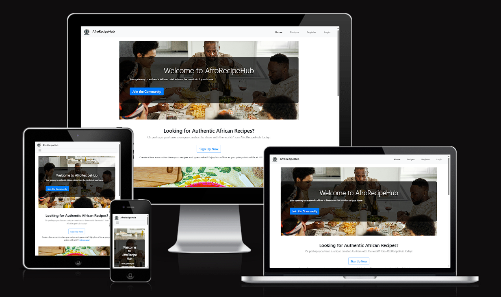

# AfroRecipeHub

[Link to the live site](https://recipehub-d875a2718a30.herokuapp.com/index)



## Introduction

AfroRecipeHub is an engaging, community-driven platform dedicated to celebrating and sharing Afro-centric culinary traditions. The platform allows users to create, browse, and bookmark recipes while engaging with the community through comments. It features robust user management, content moderation, and a gamification system that rewards users for their contributions. AfroRecipeHub is built using modern web technologies to ensure a responsive and accessible experience across all devices.

This project was developed as part of the L5 Diploma in Web Application Development at Code Institute, demonstrating comprehensive skills in full-stack web development. The application was designed with security in mind to protect user data and ensure a safe browsing experience.

## Table of Contents

- [Introduction](#introduction)
- [Strategy Plane](#strategy-plane)
- [Scope Plane](#scope-plane)
- [Structure Plane](#structure-plane)
- [Skeleton Plane](#skeleton-plane)
- [Surface Plane](#surface-plane)
- [Features](#features)
- [Technologies Used](#technologies-used)
- [Setup Instructions](#setup-instructions)
- [Usage](#usage)
- [Database Structure](#database-structure)
- [Security Features](#security-features)
- [API Integration](#api-integration)
- [Testing](#testing)
- [Deployment](#deployment)
- [Credits and Acknowledgements](#credits-and-acknowledgements)
- [Future Development](#future-development)

## Strategy Plane

### Project Goals

The AfroRecipeHub project was created with specific goals for different user types:

- **For Users**: To provide a welcoming platform where users can easily discover, share, and celebrate Afro-centric recipes.
- **For Admins**: To enable effective user content moderation ensuring that the platform remains a positive and valuable resource.
- **For the Community**: To foster a sense of community centered around Afro-centric culinary traditions, encouraging cultural exchange and exploration.

### Target Audience

AfroRecipeHub is designed for:

- **Cooking Enthusiasts**: Individuals passionate about cooking, especially those interested in Afro-centric cuisine.
- **Professional Chefs**: Culinary professionals seeking to showcase their recipes and connect with a like-minded community.
- **Food Lovers**: Anyone interested in exploring and sharing diverse culinary traditions from across Africa and the African diaspora.

### User Stories

#### Guest Users

- I want to browse recipes without creating an account so that I can explore the platform before committing.
- I want to understand the platform's purpose immediately upon visiting the homepage.

#### Registered Users

- I want to create, edit, and delete my recipes so that I can manage my content.
- I want to comment on recipes to share my thoughts and engage with the community.
- I want to bookmark my favorite recipes so that I can easily find them later.
- I want to manage my profile, including changing my username and profile image.

#### Admin Users

- I want to manage all user-generated content, including editing or deleting any recipe or comment, to maintain the platform's quality.

## Scope Plane

### Functional Requirements

AfroRecipeHub includes the following key functionalities:

- **User Registration and Authentication**: Secure user sign-up, login, and profile management.
- **Recipe Management**: Users can create, view, edit, and delete recipes.
- **Commenting System**: Users can leave comments on recipes, fostering community interaction.
- **Bookmarking**: Users can bookmark recipes for quick access from their dashboard.
- **Gamification**: A points-based system rewards users for actions like creating recipes and leaving comments, with points displayed on their profiles.
- **Admin Controls**: Admins have CRUD (Create, Read, Update, Delete) access to all user-generated content, allowing them to manage recipes and comments from the same interface as regular users.
- **Responsive Design**: The platform is fully responsive, ensuring a seamless experience on all devices.

### Content Requirements

Content within AfroRecipeHub is carefully structured to enhance usability and engagement:

- **User Profiles**: Detailed profiles including usernames, profile images, and activity points.
- **Recipes**: Each recipe includes ingredients, step-by-step instructions, and user-generated images.
- **Comments**: Users can engage with content through comments, providing feedback and sharing tips.
- **Admin Tools**: Integrated into the user interface, allowing for easy content management without the need for a separate admin dashboard.

## Structure Plane

### Site Map

1. **Home Page**: Introduction to AfroRecipeHub with links to browse recipes and register or log in.

   

2. **Recipe Pages**: Detailed views of recipes with options to filter, comment, and bookmark.

   

3. **User Dashboard**: A personalized space for users to manage their recipes, bookmarks, and profile settings.

   

### Navigation Structure

- **Top Navigation Bar**: Provides quick access to the home page, recipes, user dashboard (if logged in), and admin functionalities (if applicable).
- **Footer**: Contains links to social media, contact information, and other relevant resources.

## Skeleton Plane

The skeleton of AfroRecipeHub is designed with usability in mind. The layout is clean, with clear navigation and well-organized content that is easy to explore. The platform's structure ensures that users can quickly find what they are looking for, whether they are browsing recipes, managing their profile, or engaging with the community.

### Wireframes

Wireframes were created during the design phase to visualize the layout and flow of the platform. These wireframes guided the development process, ensuring that the final product is intuitive and user-friendly.

- **Home Page Wireframe**: Layout for the main landing page, including key navigation links and featured recipes.
- **Recipe Page Wireframe**: Structure for displaying recipes, including ingredients, instructions, and comments.
- **Dashboard Wireframe**: Design for the user dashboard, where users can manage their content and access admin tools if applicable.

## Surface Plane

The visual design of AfroRecipeHub reflects its cultural roots while maintaining a modern, professional aesthetic. The platform's design uses color, typography, and imagery to create an inviting and engaging user experience.

### Visual Design

- **Color Scheme**:

  - **Primary Color (`#0056b3`)**: Used for buttons, links, and other interactive elements, giving the platform a vibrant and cohesive look.
  - **Primary Hover Color (`#004494`)**: Applied to interactive elements during hover states to provide visual feedback.
  - **Text Color (`#333`)**: Ensures readability across the platform, with sufficient contrast against background elements.
  - **White (`#fff`)**: Used for backgrounds and form fields, maintaining a clean, uncluttered appearance.
  - **Grey Light (`#f9f9f9`)**: Provides subtle contrast for backgrounds and secondary content.
  - **Grey Dark (`#666`)**: Used for less prominent text and elements, ensuring they remain visible without overpowering primary content.
  - **Warning Button Color (`#ffcc00`)**: Draws attention to critical actions, such as form submissions or alerts.
  - **Danger Button Color (`#dc3545`)**: Used for actions like deletions, signaling caution to the user.

- **Typography**:

  - **Roboto**: A modern, sans-serif font that enhances readability and provides a clean, professional aesthetic.

- **Imagery**:

  - **Images**: All images used in the project are sourced from [Pexels](https://pexels.com), with the default stock image provided by [iStock](https://www.istockphoto.com). High-quality, culturally relevant images enhance the visual appeal and engage users.

- **Interactive Elements**:
  - Buttons, forms, and other interactive elements are designed with accessibility in mind, providing clear feedback and ensuring ease of use across all devices.

### Unique Styling of Navigation Bar and Footer

To give users a dynamic and engaging experience, special attention was given to the styling of the navigation bar and footer, particularly on authentication pages such as the login and register pages. The navigation bar and footer on these pages feature a more compact and streamlined design to keep the user's focus on the task at hand—either logging in or creating an account. This approach helps in reducing distractions and enhancing the overall user experience.

## Features

AfroRecipeHub offers a range of features designed to enhance user experience and encourage community participation:

- **User Registration and Authentication**: Secure processes for creating accounts and logging in, with user data protection as a priority.
- **Recipe Management**: Full CRUD capabilities for users to manage their recipes, including the ability to upload images, add detailed instructions, and categorize their content.
- **Commenting System**: Users can comment on recipes, with comments moderated by admins to maintain a positive community atmosphere.
- **Bookmarking**: Users can bookmark their favorite recipes for easy access from their personal dashboard.
- **Gamification**: A points system rewards users for contributing content, such as creating recipes or leaving comments, with points displayed on their profile.
- **Admin Controls**: Integrated within the user interface, allowing admins to manage all user-generated content, including the ability to edit or delete recipes and comments.
- **Responsive Design**: Ensures that AfroRecipeHub is fully functional and visually appealing on all devices, from desktops to mobile phones.

## Technologies Used

AfroRecipeHub is built using a variety of modern web technologies:

- **Flask**: A lightweight Python web framework used for building the backend of the platform.
- **MongoDB**: A NoSQL database used to store user data, recipes, and comments.
- **Flask-Login**: Handles user session management, ensuring secure authentication.
- **Flask-Bcrypt**: Provides secure password hashing, protecting user credentials.
- **Bootstrap**: A responsive front-end framework that helps ensure the platform looks great on all devices.
- **Jinja2**: A templating engine for Python, used to generate dynamic HTML content.
- **Font Awesome**: Supplies icons used throughout the platform to enhance usability and visual appeal.
- **Google Fonts**: The Roboto font is used for all textual content, providing a clean and modern look.
- **Heroku**: A cloud platform used to deploy and host the AfroRecipeHub web application.

## Setup Instructions

### Prerequisites

To run AfroRecipeHub locally, ensure you have the following installed:

- **Python 3.x**
- **pip** (Python package installer)
- **MongoDB** (Local or cloud instance)
- **Virtual environment** (Recommended for managing dependencies)

### Installation Steps

1. **Clone the Repository**:

   ```bash
   git clone https://github.com/yourusername/afrorecipehub.git
   cd afrorecipehub

   ```

2. **Install dependencies**:

   ```bash
   pip install -r requirements.txt

   ```

3. **Set up environment variables**:

   ```bash
   cp env.py.example env.py

   ```

4. **Run the application**:
   ```bash
   python app.py
   ```

## Database Structure

AfroRecipeHub uses MongoDB to manage the following collections:

AfroRecipeHub uses MongoDB to store user data, recipes, comments, and site statistics. The database schema is designed to maintain data consistency and integrity while facilitating efficient querying and filtering.

### Collections and Fields

#### 1. User Collection

| Field           | Data Type | Description                       |
| --------------- | --------- | --------------------------------- |
| `_id`           | ObjectId  | Unique identifier for the user    |
| `username`      | String    | Username of the user              |
| `email`         | String    | User's email address              |
| `password`      | String    | Hashed password                   |
| `isAdmin`       | Boolean   | Indicates if the user is an admin |
| `profile_image` | String    | Path to the user's profile image  |

#### 2. Recipe Collection

| Field          | Data Type | Description                                            |
| -------------- | --------- | ------------------------------------------------------ |
| `_id`          | ObjectId  | Unique identifier for the recipe                       |
| `title`        | String    | Title of the recipe                                    |
| `description`  | String    | Short description of the recipe                        |
| `ingredients`  | Array     | List of ingredients                                    |
| `instructions` | String    | Preparation instructions                               |
| `category_id`  | ObjectId  | Foreign key linking to the category                    |
| `created_by`   | ObjectId  | Foreign key linking to the user who created the recipe |
| `image_path`   | String    | Path to the recipe image                               |

#### 3. Categories Collection

| Field  | Data Type | Description                                           |
| ------ | --------- | ----------------------------------------------------- |
| `_id`  | ObjectId  | Unique identifier for the category                    |
| `name` | String    | Name of the category (e.g., "Main Course", "Dessert") |

#### 4. Comments Collection

| Field        | Data Type | Description                                          |
| ------------ | --------- | ---------------------------------------------------- |
| `_id`        | ObjectId  | Unique identifier for the comment                    |
| `recipe_id`  | ObjectId  | Foreign key linking to the recipe                    |
| `user_id`    | ObjectId  | Foreign key linking to the user who made the comment |
| `comment`    | String    | The comment text                                     |
| `created_at` | Date      | Timestamp of when the comment was made               |

### One-to-Many Relationships

- **User to Recipes**: A user can create multiple recipes.
- **Recipe to Comments**: A recipe can have multiple comments associated with it.

### One-to-One Relationships

- **Recipe to Category**: Each recipe belongs to a single category.

## Usage

### User Registration and Authentication

- Users can register by providing a username, email, and password.
- Passwords are securely hashed using Flask-Bcrypt before being stored in the database.
- After registering, users can log in to access personalized features like creating recipes, commenting, and bookmarking.

### Recipe Management

- Logged-in users can create new recipes, including uploading images, adding ingredients, and writing step-by-step instructions.
- Users can edit or delete their own recipes from their dashboard.
- Recipes can be viewed by all users, with filtering options to help users find specific dishes.

### Commenting and Bookmarking

- Users can leave comments on recipes to engage with other users.
- Recipes can be bookmarked for easy access later from the user’s dashboard.

### Admin Controls

- Admins have the ability to edit or delete any user-generated content, including recipes and comments, directly from the user interface.
- Admins can manage user accounts to ensure the community remains positive and focused on its culinary mission.

## Security Features

### Environment Configuration

- **Environment Variables:** All sensitive data, such as Flask configuration keys and MongoDB URIs, are stored in environment variables. This ensures that sensitive information is not hardcoded into the application and can be easily managed in different deployment environments.

### User Authentication and Authorization

- **Registration:** Passwords are hashed using Flask-Bcrypt before storing in the database, ensuring that passwords are not stored in plain text. Unique usernames and emails are enforced to prevent duplicate accounts.

- **Login:** User login is secured by checking the hashed password against the stored hash using Flask-Bcrypt. Session management is handled securely, with session cookies being set to HttpOnly to prevent JavaScript access.

- **Access Control:** Access to certain routes is restricted to authenticated users only using the @login_required decorator. Admins have additional privileges controlled via session variables (is_admin).

### Data Validation and Sanitization

- **User Input Validation:** Inputs are validated both client-side (via forms) and server-side (in Flask routes). Data is sanitized before being processed to prevent injection attacks.

### File Upload Handling

- **File Security:** Uploaded files are securely stored using secure_filename from Werkzeug to prevent directory traversal attacks. Profile images are removed if the user deletes their account, ensuring no residual data is left.

### Session Management

- **Secure Sessions:** Flask's session cookies are used with a secure SECRET_KEY. Session data is cleared upon user logout, and sessions are securely managed to prevent hijacking.

### Access Control

- **Role-Based Access:** Route access is controlled via user roles, with certain routes restricted to admins only. Users cannot modify or delete accounts other than their own unless they are admins.

### Error Handling

- **Graceful Error Handling:** Errors are handled gracefully, with appropriate flash messages displayed to the user. Internal errors are logged for further investigation.
  Logging and Monitoring

- **Operation Logging:** All critical operations are logged, and logs are monitored for suspicious activities. Logs do not contain sensitive information like passwords or API keys.

## API Integration

AfroRecipeHub features API endpoints designed to enhance the user experience. One notable API endpoint retrieves the current user's points balance and updates the frontend in real-time, providing instant feedback as users interact with the platform. This is a great example of how the platform blends backend functionality with a dynamic user interface to keep users engaged and informed.

## Testing

Testing is a critical part of the development process. Detailed testing procedures, validation, known issues, and resolutions are documented in the `TESTING.md` file. Please refer to that file for comprehensive testing information.

## Deployment

AfroRecipeHub is deployed on Heroku, a cloud platform that facilitates easy deployment and scaling of web applications.

### Deploying to Heroku

1. **Create a Heroku App**:

   - Log in to your Heroku account.
   - Create a new app in the Heroku dashboard.

2. **Set Up Environment Variables**:

   - In the Heroku dashboard, navigate to the "Settings" tab.
   - Under "Config Vars," add the same environment variables as defined in your `env.py` file.

3. **Deploy the Application**:

   - Push the code to Heroku using the following commands:
     ```bash
     git add .
     git commit -m "Deploy to Heroku"
     git push heroku main
     ```

4. **Open the Application**:
   - Once the deployment is successful, you can open the app via the Heroku dashboard or by running:
     ```bash
     heroku open
     ```

## Credits and Acknowledgements

### Additional Inspirations and Online Resources

In the development of AfroRecipeHub, Code Institutes robust materials were utilised, however, some of the following online resources and communities were instrumental:

- **MongoDB Documentation:** The MongoDB documentation was critical for understanding how to structure the database, optimize queries, and handle data efficiently in a NoSQL environment.

- **Bootstrap Documentation:** The Bootstrap documentation helped in designing the front-end of the application, ensuring that it is responsive and user-friendly across different devices.

- **Stack Overflow:** The developer community on Stack Overflow provided solutions to various coding challenges encountered during the project, from debugging issues to implementing specific features like form validation and API integrations.

- **Jinja2 Documentation:** The Jinja2 templating engine documentation was used to create dynamic and reusable HTML templates, which facilitated the development of a maintainable and scalable codebase.

- **YouTube Tutorials:** Various YouTube channels, such as Corey Schafer, provided in-depth tutorials on Python, Flask, and web development best practices, helping to clarify complex concepts and inspire practical solutions.

### References

- Sample recipe instructions were sourced from:
  - Nigerian Puff Puff: All Nigerian Recipes, Chef Lola’s Kitchen
  - Nigerian Chin Chin: African Bites, Precious Core
  - Nigerian Fried Rice: All Nigerian Recipes, Chef Lola’s Kitchen
  - Nigerian Jollof Rice: BBC Food, Food52

### Images

- All images used in the project were sourced from Pexels, except for the default stock image, which was sourced from iStock.

### Code Resources

- Flask documentation for backend development.
- Bootstrap for responsive front-end design.
- Font Awesome for icons.

### Acknowledgements

- Special thanks to the Code Institute for providing the educational resources and support to complete this project.
- Thanks to my mentor for their invaluable feedback throughout the development process.

## Future Development

While AfroRecipeHub is fully functional, there are several enhancements planned for future updates:

- **Advanced Search Filters**: Implement search filters based on ingredients, preparation time, and dietary restrictions.
- **User Rating System**: Allow users to rate recipes, providing additional feedback for recipe creators.
- **Enhanced Gamification**: Expand the points-based system to include badges and leaderboards, encouraging more engagement.
- **Recipe Categories**: Further categorize recipes into subcategories for easier navigation.

## Conclusion

AfroRecipeHub serves as a platform that not only shares Afro-centric recipes but also builds a community around the rich and diverse culinary traditions of Africa and its diaspora.
