# AfroRecipeHub Testing Documentation

This document outlines the testing procedures, validation, known issues, and resolutions for the AfroRecipeHub project.

## Table of Contents

- [Manual Testing](test.md#manual-testing)
- [Automated Testing](test.md#automated-testing)
- [Validation](test.md#validation)
- [Known Issues and Resolutions](test.md#known-issues-and-resolutions)
- [Cross-Browser Testing](test.md#cross-browser-testing)
- [Responsiveness Testing](test.md#responsiveness-testing)
- [User Testing Stories](test.md#user-testing-stories)
    - [Guest User](test.md#1-guest-user)
    - [Registered User](test.md#2-registered-user)
    - [Admin User](test.md#3-admin-user)
- [Additional Testing Information](test.md#additional-testing-information)

## Manual Testing

### Test Cases

| **Feature**             | **Test Case**                                                        | **Expected Outcome**                                                | **Result**   |
|-------------------------|----------------------------------------------------------------------|----------------------------------------------------------------------|--------------|
| **Navigation Bar**      | Ensure all links work and lead to the correct pages.                 | Links should direct to appropriate pages, and navigation should be smooth. | Passed       |
| **User Registration**   | Test user registration with valid and invalid data.                  | Registration should succeed with valid data and fail with invalid data. | Passed       |
| **User Login**          | Test user login with correct and incorrect credentials.              | Login should succeed with correct credentials and fail with incorrect ones. | Passed       |
| **Recipe Management**   | Test adding, editing, and deleting recipes.                          | Recipes should be added, edited, and deleted correctly, and changes should be reflected in the database. | Passed       |
| **Commenting System**   | Test adding and deleting comments on recipes.                        | Comments should appear under the relevant recipes, and deleted comments should be removed from the UI and database. | Passed       |
| **Bookmarking**         | Test bookmarking and unbookmarking recipes.                          | Bookmarked recipes should be added to the user's dashboard, and unbookmarked recipes should be removed. | Passed       |
| **Admin Management**         | Test admin functions for managing user recipes and comments.      | Admin should be able to manage all user-generated content. | Passed       |
| **Profile Management**  | Test updating profile details and uploading profile images.          | Profile details should update correctly, and images should replace previous ones. | Passed       |
| **Gamification System** | Test point allocation for creating recipes and leaving comments.     | Points should be awarded for actions like creating recipes and leaving comments. | Passed       |

## Automated Testing (Future Goal)

Currently, the project does not include automated testing. Future versions may implement unit tests using Python's `unittest` or `pytest` frameworks.

## Validation

### HTML Validation

All HTML files were validated using the [W3C Markup Validation Service](https://validator.w3.org/). No major errors or warnings were found.

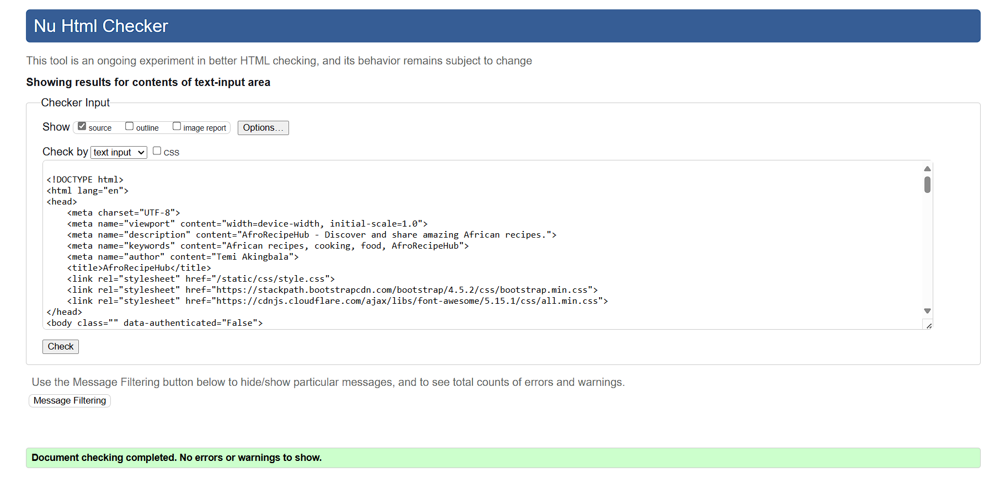

### CSS Validation

All CSS files were validated using the [W3C CSS Validation Service](https://jigsaw.w3.org/css-validator/). No major errors or warnings were found.

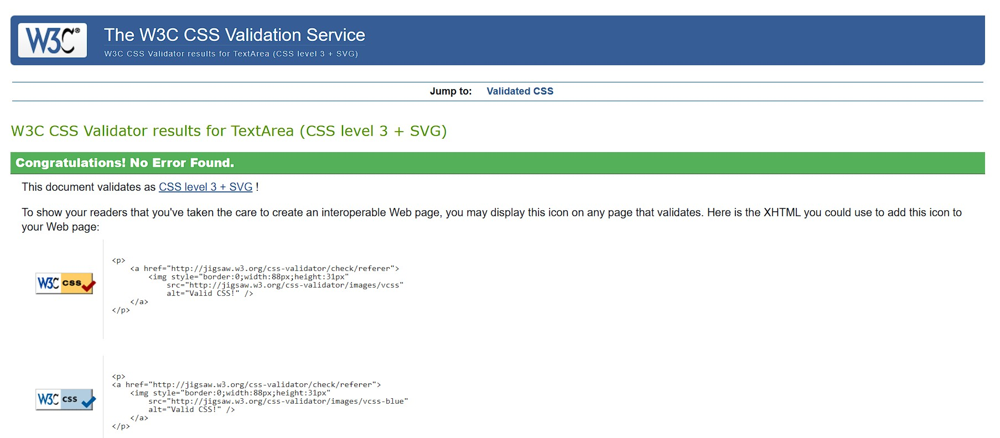

### JavaScript Validation

JavaScript files were validated using [JSHint](https://jshint.com/). Minor warnings were addressed, and no major issues were found.

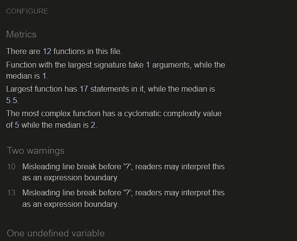

### Python Code Validation

Python code was validated using [CI Python Linter](https://pep8ci.herokuapp.com/) by Code Institute. The following issues were identified and addressed:

- **Line length**: Some lines exceeded 79 characters and were refactored.
- **Blank line warnings**: Added or removed blank lines as necessary to comply with PEP8.

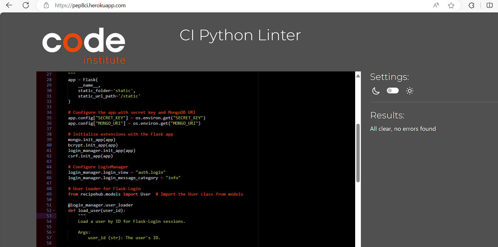

## Known Issues and Resolutions

### Responsive Design Issues

- **Issue**: Some UI elements were not fully responsive on smaller screens.
- **Resolution**: Applied media queries to adjust layouts and padding for smaller screen sizes.

### CSRF Token Handling

- **Issue**: Some forms were missing CSRF tokens, causing submission failures.
- **Resolution**: Ensured all forms include CSRF tokens, particularly those created dynamically.

### Session Management

- **Issue**: Session expiration was not handled properly in some cases.
- **Resolution**: Implemented proper session expiration handling and auto-logout for inactive sessions.

## Cross-Browser Testing

AfroRecipeHub was tested on the following browsers:

- **Google Chrome**: Passed
- **Mozilla Firefox**: Passed
- **Safari**: Passed
- **Microsoft Edge**: Passed
- **Samsung Internet Browser**: Passed

No cross-browser compatibility issues were identified.

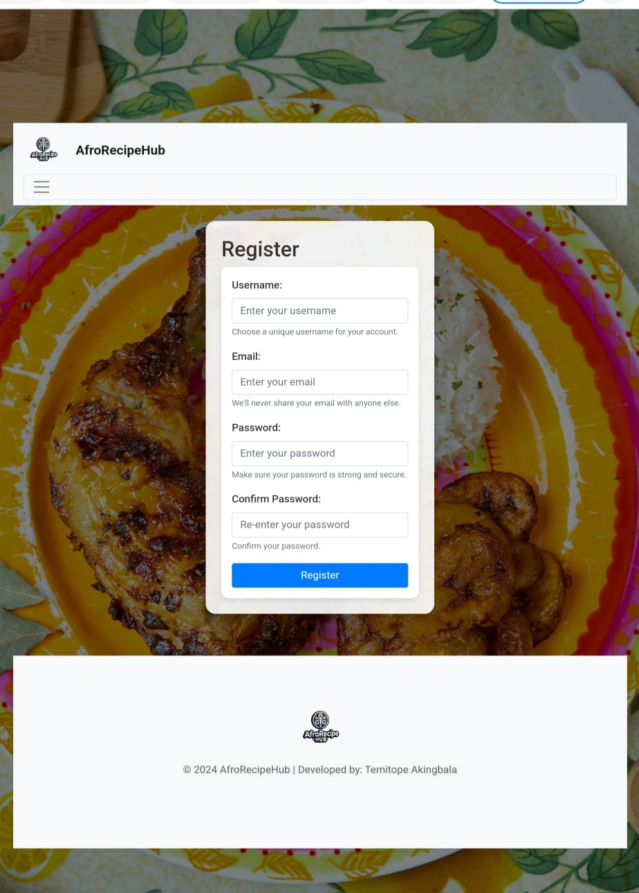

## Responsiveness Testing

The platform was tested on various devices to ensure responsiveness:

- **Desktop**: Passed
- **Laptop**: Passed
- **Tablet**: Passed
- **Smartphone**: Passed

All UI elements adjusted correctly across different screen sizes.

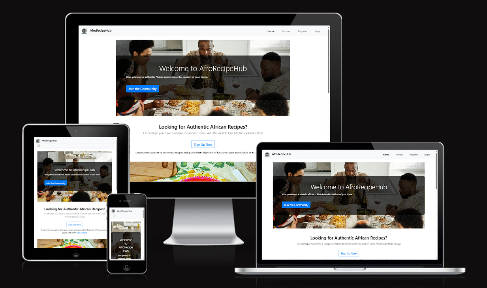

## User Testing Stories

This section outlines detailed, scenario-based user testing for different user types in AfroRecipeHub. Each story includes step-by-step actions and corresponding expected outcomes.

### 1. Guest User

#### **Scenario:** Browsing Recipes Without an Account

**Steps:**

1. Navigate to the AfroRecipeHub homepage.
   - 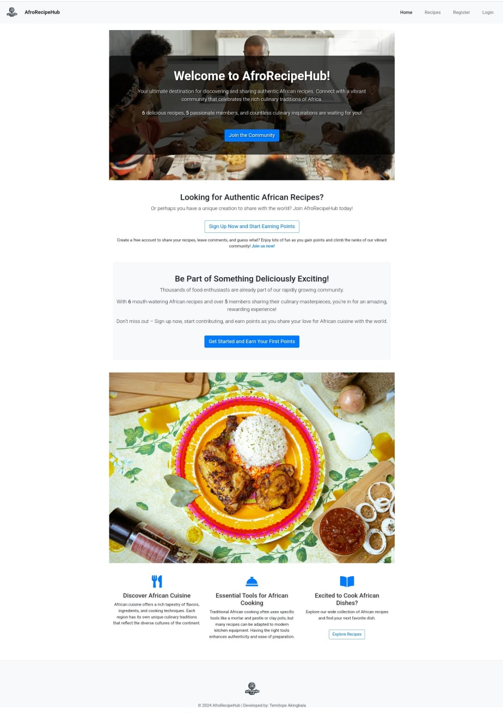

2. Click on the "Recipes" link in the navigation bar.
   - 

3. Browse through the available recipes. Ensure that each recipe is clickable and directs to the recipe detail page.
   - 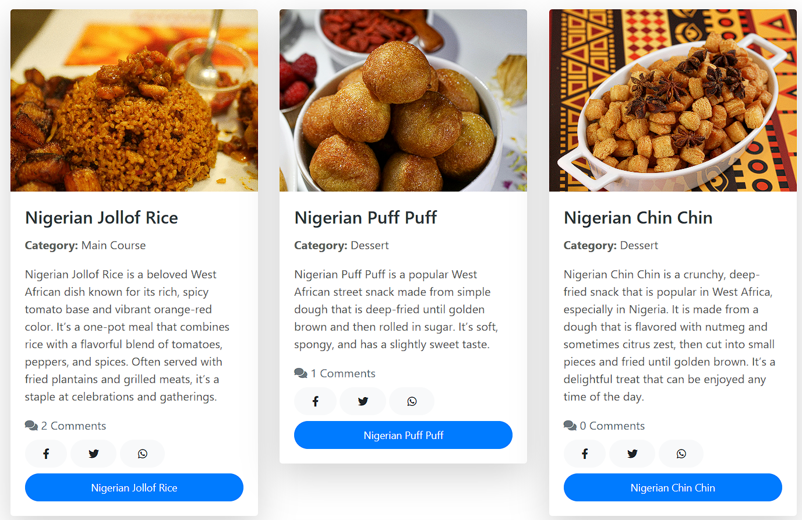

4. Attempt to leave a comment. The platform should prompt the user to log in or register.
   - 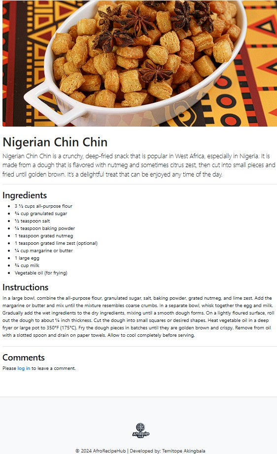

**Expected Outcome:**

- Guest users can browse recipes but cannot bookmark or comment without an account.

### 2. Registered User

#### **Scenario:** Creating a New Recipe

**Steps:**

1. Log in to AfroRecipeHub with valid credentials.
   - 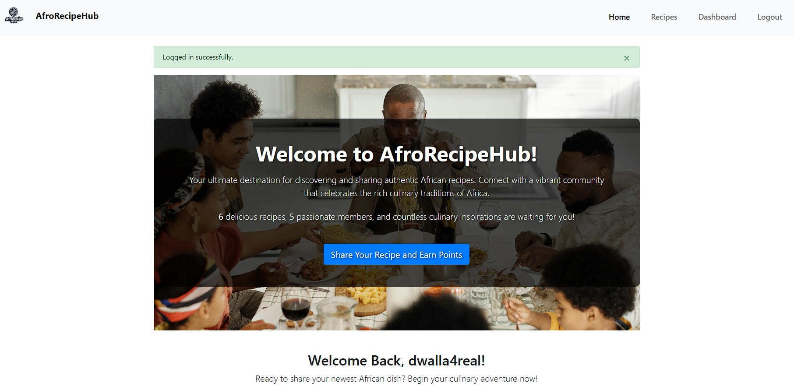

2. Navigate to the "Dashboard" from the top navigation bar.
   - 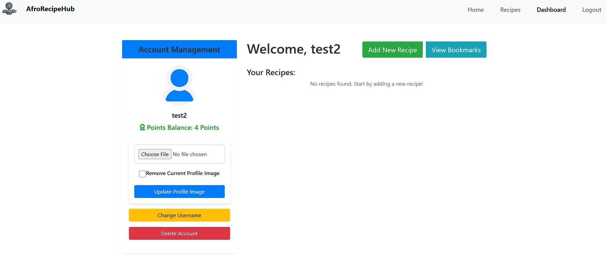

3. Click on "Add New Recipe" in the dashboard.
   - 

4. Fill out the recipe form, including title, ingredients, instructions, and upload an image.
   - 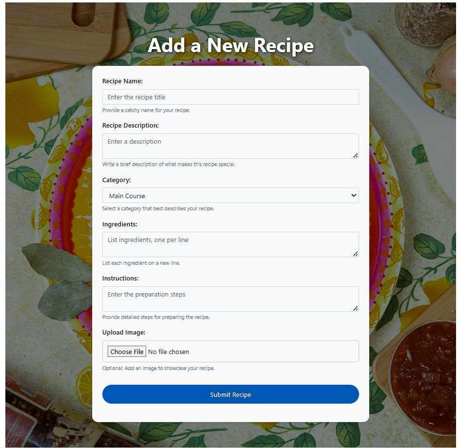

5. Submit the form and check that the new recipe appears in your dashboard and in the public recipes list.
   - 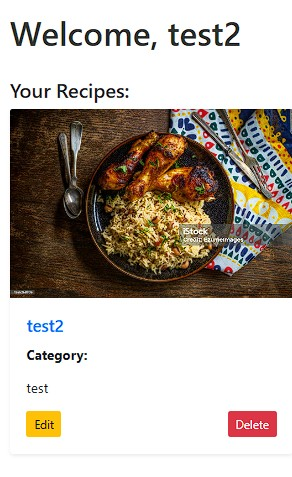

**Expected Outcome:**

- The user can successfully create, view, edit, and delete their recipes. The new recipe is visible to all users.

### 3. Admin User

#### **Scenario:** Managing User-Generated Content

**Steps:**

1. Log in as an admin user.
   - 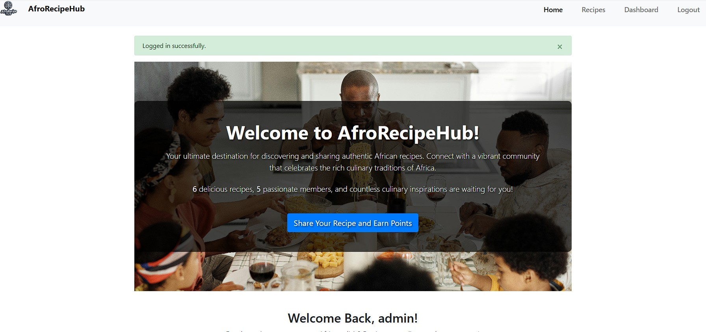

2. Navigate to the "Recipe Page" and view all user-generated content with Edit and Delete functions shown.
   - 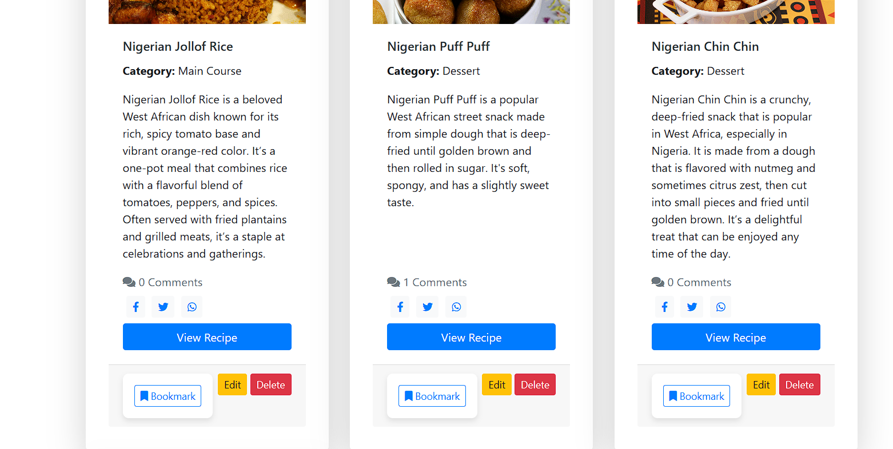

3. Select a recipe and choose to edit or delete it, then verify that the changes are reflected in the public recipes list
   - 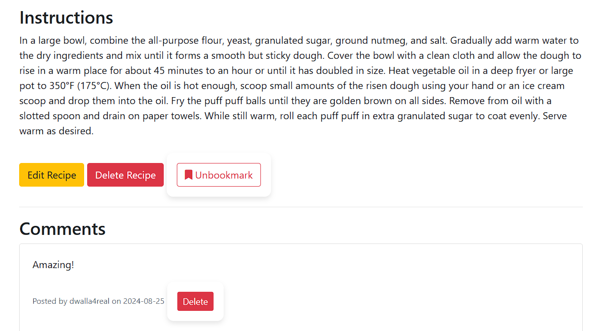

**Expected Outcome:**

- Admin users can edit or delete any user-generated content, and the changes are immediately reflected across the platform.

## Additional Testing Information

### Performance Testing

Basic performance testing was conducted to ensure the platform loads efficiently. The following optimizations were made:

- **Image Optimization**: All images were compressed to reduce load times.
- **Database Indexing**: Indexed key fields in MongoDB to speed up query times.

## Conclusion

AfroRecipeHub has undergone extensive testing to ensure it meets the requirements for functionality, responsiveness, and security. All identified issues have been resolved, and the platform is fully operational across multiple devices and browsers.
